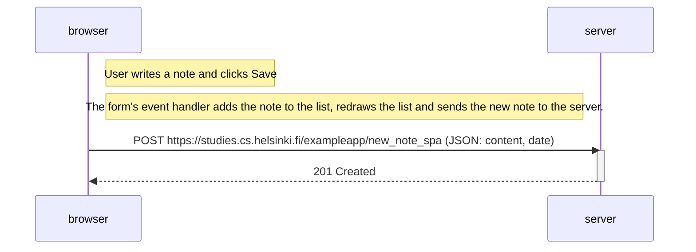

# POST Note Diagram with SPA Mermaid

```mermaid

sequenceDiagram
    participant browser
    participant server

    Note right of browser: User writes a note and clicks Save

    Note right of browser: The form's event handler adds the note to the list, redraws the list and sends the new note to the server.

    browser->>server: POST https://studies.cs.helsinki.fi/exampleapp/new_note_spa (JSON: content, date)
    activate server
    server-->>browser: 201 Created
    deactivate server

```
